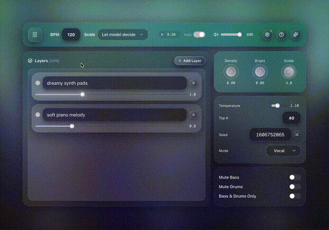

# Underlay

Custom UI for Lyria Realtime API. Web app or VST3 plugin.

<p align="center">

⋆·°:*⋆·°:* ✞★彡♡︎✦☾⛥✵ ✧☯︎♱ *:·°⋆*:·°⋆｡ ♡︎✧★彡✞☾♱✦ ☯︎⋆·°:*⋆·°:*  

**[Try it live](https://annsts.github.io/underlay/)**  

</p>



## Quick Start

Get Google Gemini API key: https://ai.google.dev/gemini-api/docs/api-key

### Web App

```bash
npm install
npm run dev
# Visit http://localhost:3000
```

Production: `npm run build` → deploy `out/` directory

### VST3 Plugin

**Download**: [UnderlayVST-v1.0.0-macOS.pkg](vst/dist/UnderlayVST-v1.0.0-macOS.pkg)

Or build from source:

```bash
npm run vst:build
# Creates vst/dist/UnderlayVST-v1.0.0-macOS.pkg
```

See [vst/README.md](vst/README.md) for installation and build instructions.

## Commands

```bash
npm run dev        # Dev server
npm run build      # Build static export
npm run vst:build  # Build VST
npm run lint       # Lint
npm run format     # Format
```

## Architecture

```
src/                           # Next.js app (web + VST WebView)
vst/                           # VST3 C++ plugin
  src/                         # C++ implementation
  scripts/                     # Build scripts
```

## API Key Storage

- **Web**: sessionStorage (cleared on close)
- **VST**: in-memory (per session)

## License

MIT
